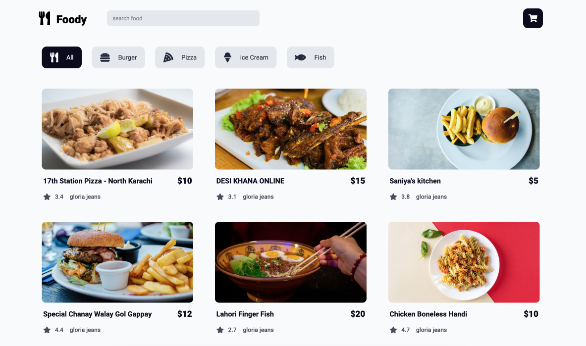

# Food Ordering System

This project is a simple food ordering system created with HTML, CSS, and JavaScript. It allows users to:

-   Browse through a variety of food items.
-   Add items to their order list.
-   View and manage their orders.
-   Search for specific items.
-   Filter items by category.
-   Sort items based on ratings and prices.

## Usage

1. Explore the food gallery.
2. Click on items to see more details.
3. Add items to your order.
4. Manage your order list.
5. Use search to find specific items.
6. Filter items by category.
7. Sort items by ratings and prices.
